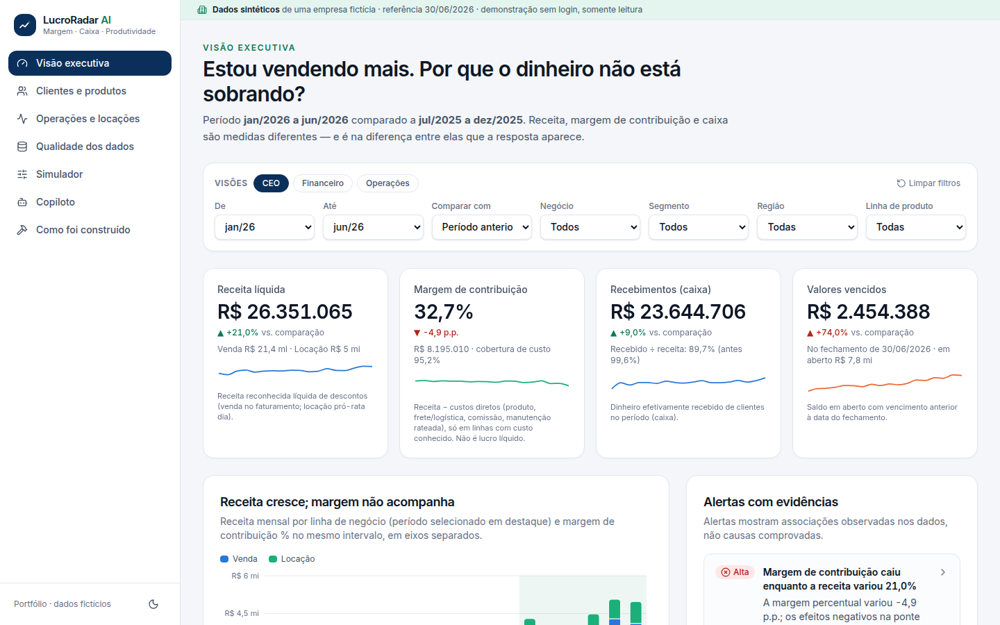
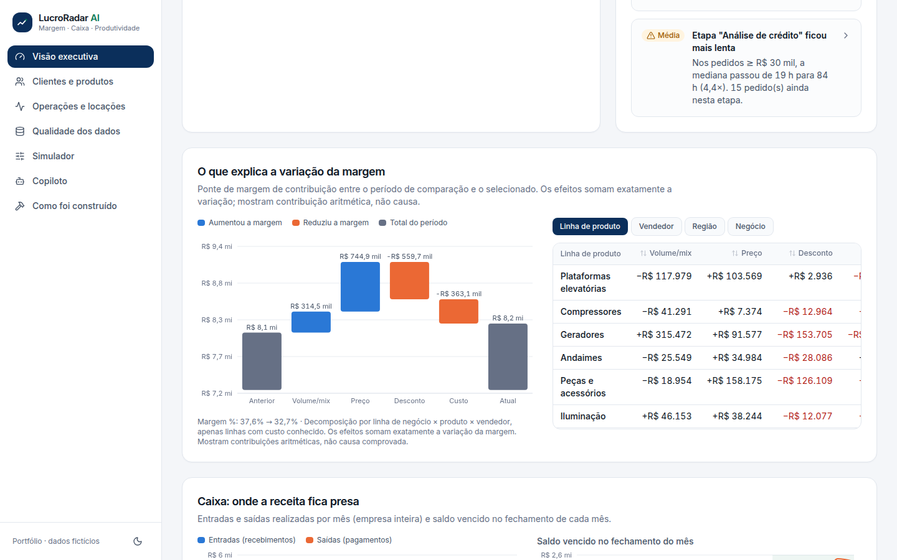
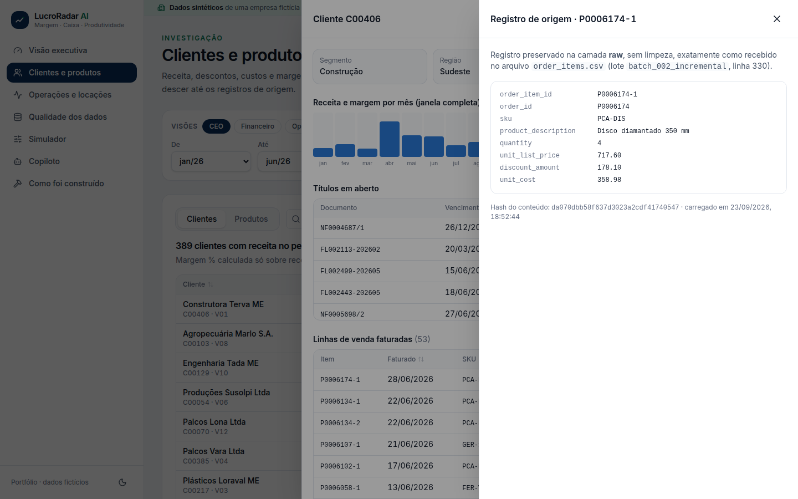
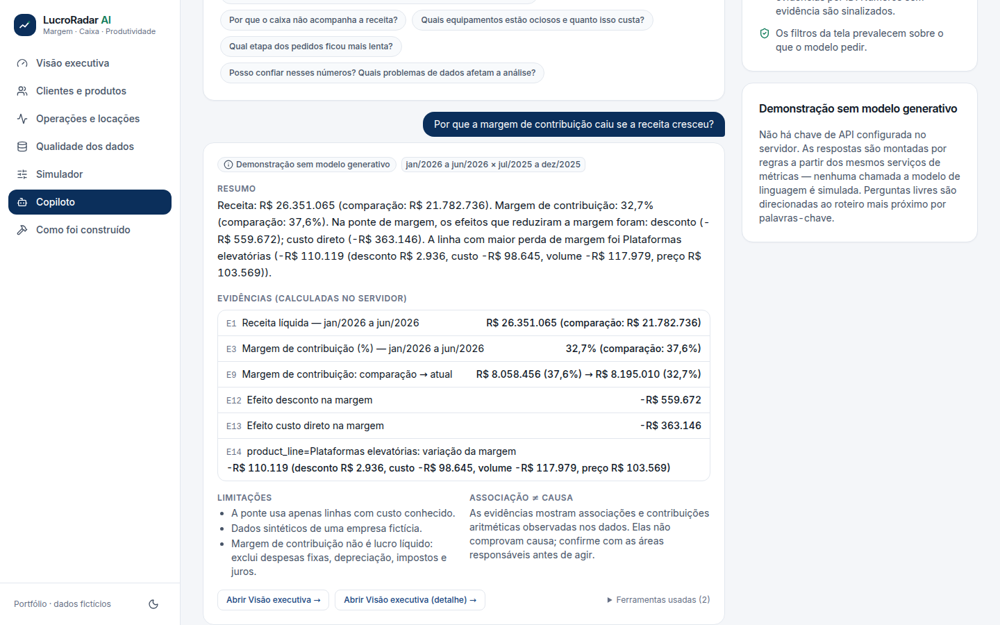
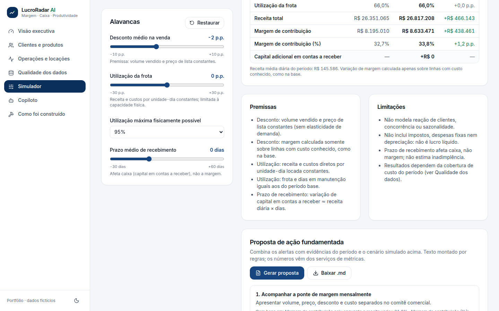
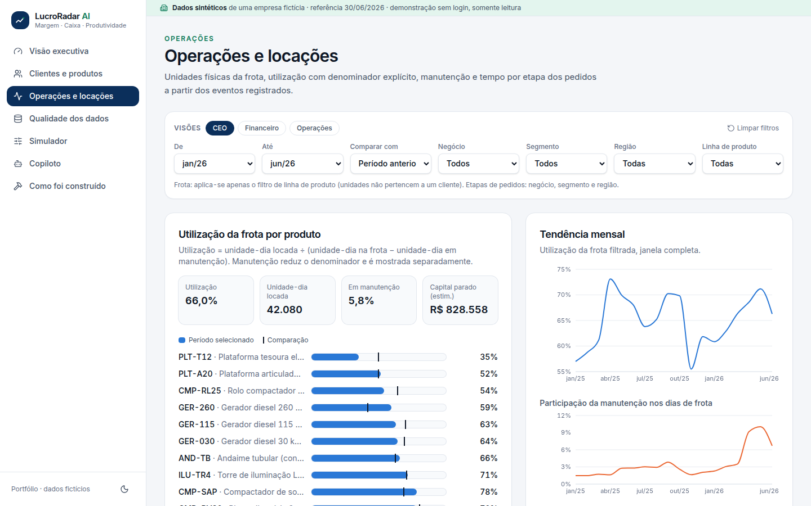
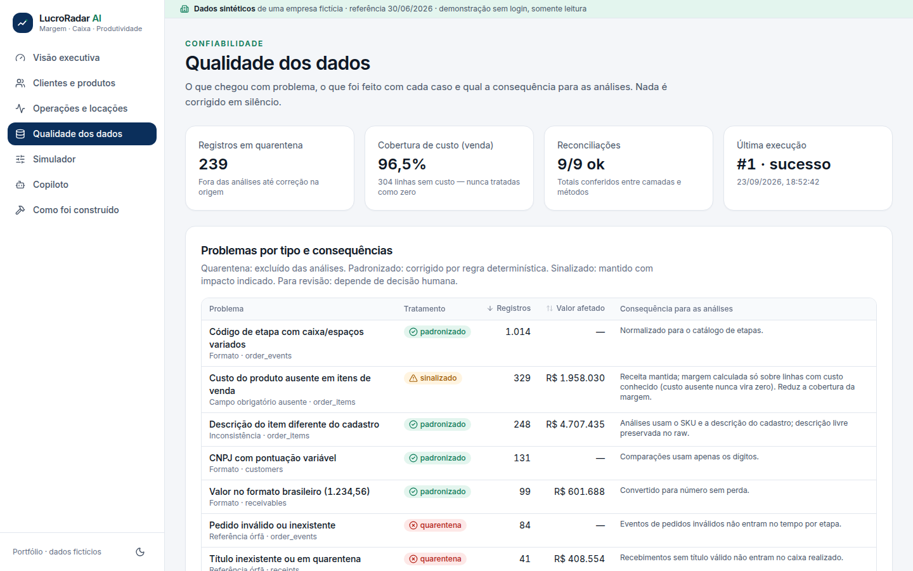

# LucroRadar AI

> **“Estou vendendo mais. Por que o dinheiro não está sobrando?”**

Plataforma de inteligência empresarial que separa **receita**, **margem de contribuição** e
**caixa**, mostra o que puxou a margem para baixo, onde o dinheiro ficou preso e como a operação
está usando a frota — com dados conciliados, qualidade de dados visível e um copiloto de IA que
só responde com evidências calculadas no servidor.

**Todos os dados são sintéticos**, de uma empresa fictícia brasileira que vende e aluga
equipamentos. Nenhum nome, dado ou marca de empresa real é usado.



## A jornada

1. **Identificar a queda de margem** — receita, margem de contribuição, recebimentos e vencidos
   com comparação de períodos, alertas com evidências e ponte de margem.
2. **Investigar** clientes, produtos e contratos até a linha do arquivo de origem.
3. **Perguntar ao copiloto** o que explica a variação (modo demonstração funciona sem chave).
4. **Simular** desconto, utilização da frota e prazo de recebimento, com premissas visíveis.
5. **Gerar uma proposta de ação** ligada aos alertas e ao cenário simulado (download em Markdown).

| | |
|---|---|
|  |  |
|  |  |
|  |  |

Capturas reais da aplicação rodando via Docker Compose (tema claro, escuro e celular em
`docs/screenshots/`).

## Como executar

### Opção A — Docker Compose (recomendado)

```bash
cp .env.example .env        # opcional: ajuste senha local, seed, data de referência
docker compose up --build   # db → pipeline (gera + carrega + dbt build) → api → web
```

Abra <http://localhost:3000> e clique em **Explorar demonstração**. A API fica em
<http://localhost:8000/docs>. n8n (opcional): `docker compose --profile automation up n8n`.

### Opção B — local

Requisitos: Python 3.11+, [uv](https://docs.astral.sh/uv/), Node 22, PostgreSQL 16 (com as
extensões `pg_trgm` e `unaccent`, incluídas no pacote contrib).

```bash
createuser -s lucroradar && createdb -O lucroradar lucroradar   # ou use o Postgres do Compose: docker compose up db
export POSTGRES_PASSWORD=lucroradar                              # demais variáveis: ver .env.example
make install      # uv sync --all-extras + npm ci
make pipeline     # gera dados sintéticos, carrega em lotes e roda dbt build
make api          # http://localhost:8000
make web          # http://localhost:3000 (em outro terminal)
```

Reexecutar `make pipeline` não duplica registros: arquivos já carregados são reconhecidos pelo
hash e ignorados.

## Testes e verificações

```bash
make test-python   # unitários, integração com o banco e avaliações do copiloto (pytest)
make test-dbt      # testes de dados: integridade referencial, regras e reconciliação
make test-n8n      # lógica do workflow n8n
make test-e2e      # Playwright (com API e web em execução)
make lint          # ruff, eslint, tsc
make summary       # consolida os relatórios reais em apps/web/public/test-summary.json
```

Resultados obtidos na última execução desta entrega estão em
[`docs/implementation-plan.md`](docs/implementation-plan.md#status-por-etapa). O CI
(`.github/workflows/ci.yml`) executa pipeline, reexecução, pytest, dbt, n8n, build da
web e Playwright.

## O que depende de credenciais

| Recurso | Sem credencial | Com credencial |
|---|---|---|
| Copiloto | **Demonstração sem modelo generativo**: perguntas roteirizadas respondidas pelos mesmos serviços de métricas | `ANTHROPIC_API_KEY` na API → perguntas livres com Claude e ferramentas controladas ([docs/copilot.md](docs/copilot.md)) |
| n8n | Workflow roda manualmente com saída de teste | Envio de e-mail/mensagem exige credencial no n8n (nó desativado) |
| Hospedagem | — | Não realizada ([docs/hosting.md](docs/hosting.md)) |

## Estrutura

```
.
├── apps/web              Next.js + TypeScript + Tailwind + Recharts; Playwright em e2e/
├── services/api          FastAPI: métricas, alertas, ponte de margem, simulador, proposta, copiloto
├── data/generator        gerador determinístico (seed, data de referência) + manifesto de verdade
├── data/ingestion        carga em lotes para raw, auditoria, CLI do pipeline
├── analytics/dbt         staging → marts → quality, seeds, testes e reconciliação
├── automations/n8n       workflow importável, lógica testada, payloads de exemplo
├── tests                 pytest (python/) e avaliação ao vivo do LLM (evals/)
├── infra/docker          imagem Python (pipeline e API)
└── docs                  arquitetura, modelo de dados, métricas, pipeline, copiloto, hospedagem
```

## Documentação

- [Arquitetura](docs/architecture.md) · [Modelo de dados](docs/data-model.md) ·
  [Métricas e regras de negócio](docs/metrics.md) · [Pipeline](docs/pipeline.md) ·
  [Dados sintéticos](docs/synthetic-data.md) · [Copiloto](docs/copilot.md) ·
  [Automação n8n](automations/n8n/README.md) · [Hospedagem](docs/hosting.md) ·
  [Plano e status](docs/implementation-plan.md)

## Limitações conhecidas

- Dados sintéticos com cenários injetados; não representam nenhum mercado real.
- Margem de contribuição exclui despesas fixas, depreciação, impostos e juros — **não é lucro**.
- Valores sem impostos; custo de manutenção entra só quando a ordem é concluída.
- Clientes possivelmente duplicados não são unificados automaticamente (decisão humana).
- Simulações são determinísticas com premissas simples (sem elasticidade, sem previsão estatística).
- Integração com LLM implementada e testada com cliente falso; não executada contra o provedor
  real nesta entrega (sem chave no ambiente).
- Demonstração sem autenticação; presets CEO/Financeiro/Operações são atalhos de filtros.

## Licença

Código original sob [MIT](LICENSE). Dependências e suas licenças em
[THIRD_PARTY_NOTICES.md](THIRD_PARTY_NOTICES.md).

---

## English summary

**LucroRadar AI** answers a common owner question — *“We are selling more, so why isn't cash
left over?”* — for a fictitious Brazilian equipment sales & rental company using fully synthetic
data. It separates revenue, contribution margin and cash; decomposes margin changes (volume,
list price, discount, cost); tracks overdue receivables, fleet utilization (with an explicit
denominator), maintenance and order-stage cycle times; surfaces data-quality issues, quarantined
records and duplicate-customer candidates; runs deterministic what-if simulations; drafts an
evidence-backed action proposal; and offers an AI copilot that can only call controlled tools and
cite server-computed evidence (a no-key demo mode works out of the box).

Stack: deterministic Python data generator → idempotent batch ingestion into PostgreSQL →
dbt Core (staging/marts/quality, referential and reconciliation tests) → FastAPI (read-only) →
Next.js/TypeScript/Tailwind/Recharts UI (pt-BR, BRL, light/dark, mobile) · n8n workflow ·
Docker Compose · pytest, dbt tests and Playwright · GitHub Actions.

Run: `docker compose up --build`, then open <http://localhost:3000>.
