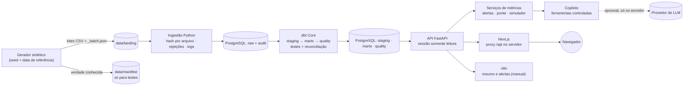

# Arquitetura

## Decisões

| Tema | Decisão | Motivo |
|---|---|---|
| Separação de camadas | `raw` (texto, como recebido) → `staging` (tipos, validação) → `marts` (fatos/dimensões) → `quality` | Rastreabilidade até a linha do arquivo |
| Incrementalidade | Na camada raw, por lote. dbt reconstrói tabelas | Volume pequeno; reconstrução é idempotente e simples de auditar |
| Versões de registros | Tabelas de estado (contratos, manutenções, clientes) chegam de novo no lote seguinte; a staging escolhe o lote mais recente | Simula extrações "snapshot" comuns em ERPs |
| API | SQL fixo e parametrizado; `default_transaction_read_only=on`; `statement_timeout` | Nenhuma escrita a partir da demonstração pública |
| Filtros | Lista fechada de colunas; validação contra valores existentes; aplicabilidade declarada por conjunto de dados | Evita injeção e deixa explícito quando um filtro não se aplica |
| Web | Next.js chama `/api/*` do próprio servidor, que repassa à API (`API_URL`) | Navegador nunca vê endereço interno nem chaves |
| Cenários do simulador | Parâmetros no `sessionStorage` e enviados ao servidor, que só calcula | Isolamento por sessão sem estado compartilhado |
| IA | `CopilotProvider` com `DemoProvider` (regras) e `AnthropicProvider` (tool use) | Demonstração funciona sem chave; integração real no servidor |

## Componentes

- `data/generator` — `lucroradar_generator`: simulação diária da frota, vendas, contratos, títulos,
  pagamentos e eventos; injeção de problemas; divisão em lotes; manifesto.
- `data/ingestion` — `lucroradar_ingestion`: contrato de colunas, carga via COPY, `audit.*`, CLI
  `lucroradar-ingest run|load|status`.
- `analytics/dbt` — modelos, seeds (UF→região, códigos legados, etapas), macros de parsing seguro,
  testes genéricos e singulares.
- `services/api` — `lucroradar_api`: FastAPI, métricas, alertas, ponte, simulador, proposta,
  copiloto.
- `apps/web` — Next.js (App Router), Tailwind, Recharts, Playwright.
- `automations/n8n` — workflow importável + lógica testada.
