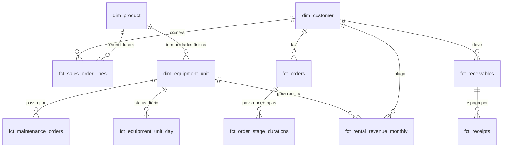

# Modelo de dados

## Relacionamentos principais

## Granularidade das tabelas fato

| Tabela | Uma linha é | Medidas principais |
|---|---|---|
| `fct_sales_order_lines` | item de pedido de venda válido | quantidade, bruto, desconto, receita, custo (nullable), frete, comissão, margem |
| `fct_rental_revenue_monthly` | item de contrato (unidade física) × mês | dias ativos, receita reconhecida, receita de tabela, desconto |
| `fct_rental_logistics_costs` | custo logístico × item do contrato | valor rateado |
| `fct_rental_maintenance_allocation` | mês × SKU × cliente | manutenção rateada |
| `mart_contribution_monthly` | mês × negócio × cliente × produto × vendedor | receita, custos, margem, cobertura |
| `fct_receivables` | título a receber (parcela) | valor, pago, em aberto, status, dias de atraso |
| `fct_receipts` | recebimento | valor, dias após vencimento |
| `mart_receivables_monthly` | fechamento × cliente × negócio | em aberto, vencido, vencido > 30 dias |
| `fct_payables` | conta a pagar | valor, pago, em aberto |
| `mart_cash_monthly` | mês × direção × categoria | valor |
| `mart_cash_forecast` | semana × direção | valor previsto |
| `fct_equipment_unit_day` | unidade física × dia | status, contrato, manutenção |
| `mart_fleet_utilization_monthly` | mês × SKU | dias na frota/manutenção/disponíveis/locados/ociosos, utilização |
| `mart_unit_utilization` | unidade física | uso na janela e em 90 dias |
| `fct_maintenance_orders` | ordem de manutenção | dias parada, custo (NULL se aberta) |
| `fct_orders` | pedido | status, etapa atual, lead time |
| `fct_order_stage_durations` | pedido × etapa | entrada, saída, duração, aberta |

## Camada raw e auditoria

- `raw.<tabela>`: todas as colunas em texto + `_batch_id`, `_source_file`, `_row_number`,
  `_record_hash`, `_loaded_at`. Chave primária (`_batch_id`, `_row_number`).
- `audit.load_batches`, `audit.load_files` (SHA-256 por arquivo), `audit.ingestion_rejects`,
  `audit.pipeline_runs`, `audit.pipeline_run_steps`.

## Qualidade

- `quality.dq_quarantine` — registro inválido + motivo + conteúdo original (`raw_payload`).
- `quality.dq_issue_summary` — problema × tabela, tratamento e consequência.
- `quality.dq_customer_duplicate_candidates` — pares candidatos com evidência e recomendação.
- `quality.rec_row_counts`, `quality.rec_financial_totals` — reconciliações (testadas).
